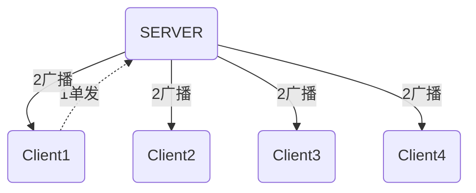

# Build a Chatroom App with Python

## 1. 基础知识

### CS模型

### 协议

### Sockets

https://docs.python.org/3/library/socket.html

线程

https://docs.python.org/3/library/threading.html

参考

https://levelup.gitconnected.com/learn-python-by-building-a-multi-user-group-chat-gui-application-af3fa1017689

加密协议

https://www.superltx.com/archives/67

## 20201007

close方法可以释放一个连接的资源，但是不是立即释放，如果想立即释放，那么在close之前使用shutdown方法

shut_rd() -------关闭接受消息通道

shut_wr()--------关闭发送消息通道

shut_rdwr()-------连个通道都关闭

使用：在close()之前加上shutdown(num)即可 [shut_rd(), shut_wr(), shut_rdwr()分别代表num 为0 1 2 ]

[完全释放资源](https://blog.csdn.net/tiankong1213/article/details/93537608?utm_medium=distribute.pc_relevant_t0.none-task-blog-BlogCommendFromMachineLearnPai2-1.edu_weight&depth_1-utm_source=distribute.pc_relevant_t0.none-task-blog-BlogCommendFromMachineLearnPai2-1.edu_weight)